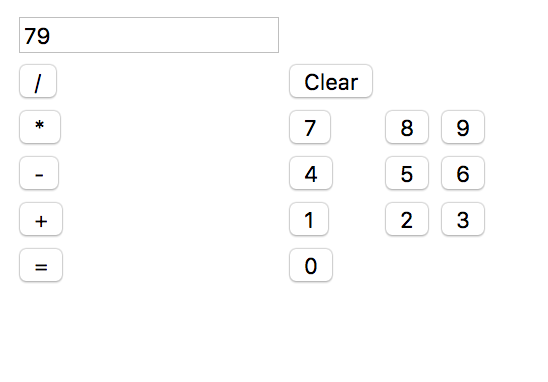

# JS Calculator

### Summary
For this project I created a basic calculator. All the HTML was created dynamically using JavaScript and the functionality is also made in Java Script as well. The user can add, subtract, divide, and multiply two numbers. The clear button works as well as the = button will bring back the sum, difference, quotient and product of the two numbers based on the operator button selected.

### Disclaimer
All the JavaSCript files are attached and run through the "home.html" instead of the "index.html" because the tests wanted the table to be created through HTML and not dynamically. Upon making the HTML dynamically none of the tests were working.

###

